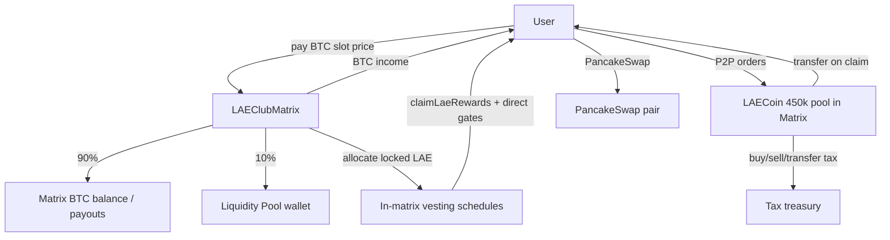

# LAE Club — Contract Architecture (2 contracts only)

## Required contracts

| Contract | Role |
|----------|------|
| **LAEClubMatrix.sol** | 15-slot · 14-spot matrix + payment split + LAE lock/vest/claim + admin reward settings |
| **LAECoin.sol** | 500k LAE token, taxes, P2P marketplace, reward pool accounting |

No NFTs. No separate router, vesting, staking, or liquidity manager contracts.

## Flow

## Registration (slot 1 = 0.001 BTC)

1. User calls `registrationExt(referrerId)` on **LAEClubMatrix**
2. Matrix pulls full slot price
3. **10%** → `liquidityPool` wallet
4. **90%** distributed across the 14-position matrix (MatrixCore placement)
5. LAE reward calculated from the liquidity slice → **locked vesting schedule** (not transferred)
6. Matrix runs registration + 14-spot placement

## 15-slot matrix payout map (per slot cycle)

| Spot | Role |
|---|---|
| 1, 2 | Upline income (spillover up) |
| 3, 6, 8, 9, 11, 12 | Your income (paid to slot owner) |
| 4 | First cycle: held for auto-upgrade · recycle cycles: Club Pool |
| 5 | First cycle: triggers free next-slot upgrade · recycle cycles: your income |
| 7, 10 | 1st downline spillover |
| 13 | 2nd downline spillover |
| 14 | Recycle / reinvest |

## LAE lock / claim (inside matrix)

- 20 months, 5%/month default (admin-configurable per month)
- Per-second unlock within each month tranche
- Month N claim requires **N directs** (default: M1=1 … M20=20)
- Unqualified tokens stay locked — never burned
- `claimLaeRewards()` transfers LAE from matrix balance (450k pool)

## LAECoin

- Total cap: **500,000 LAE**
- Reward pool: **450,000 LAE** minted to matrix on bootstrap
- Residual **50,000 LAE** → treasury / liquidity / operations wallets
- Admin: buy/sell/transfer tax, P2P enable/fee, PancakeSwap pair flag

## Admin controls

**LAEClubMatrix:** split %, LAE price, monthly release %, direct requirement table, slot prices, pools

**LAECoin:** taxes, P2P, liquidity pair (PancakeSwap), bootstrap supply

## Deploy order

See [DEPLOY.md](./DEPLOY.md).
