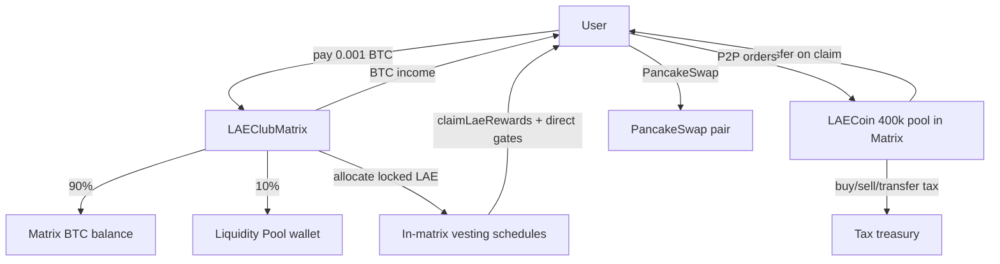

# LAE Club — Contract Architecture (4 contracts only)

## Required contracts

| Contract | Role |
|----------|------|
| **LAEClubMatrix.sol** | BTitan 12×14 matrix + payment split + LAE lock/vest/claim + admin reward settings |
| **LAECoin.sol** | 500k LAE token, taxes, P2P marketplace, reward pool accounting |
| **LAERegistrationPassNFT.sol** | Registration pass NFT |
| **LAERoyalCardNFT.sol** | Royal rank NFTs (L3/L6/L9/L12) |

No separate router, vesting, staking, or liquidity manager contracts.

## Flow

## Registration (0.001 BTC example)

1. User calls `registrationExt(referrerId)` on **LAEClubMatrix**
2. Matrix pulls full payment
3. **10%** → `liquidityPool` wallet
4. **90%** stays in matrix for BTitan distribution (unchanged logic)
5. LAE reward calculated from liquidity slice → **locked schedule** (not transferred)
6. Matrix runs registration + 14-spot placement (unchanged)

## LAE lock / claim (inside matrix)

- 20 months, 5%/month default (admin-configurable per month)
- Per-second unlock within each month tranche
- Month N claim requires **N+1 directs** (default: M1=2 … M20=21)
- Unqualified tokens stay locked — never burned
- `claimLaeRewards()` transfers LAE from matrix balance (400k pool)

## LAECoin

- Total cap: **500,000 LAE**
- Reward pool: **400,000 LAE** minted to matrix on bootstrap
- Residual **100,000 LAE** → treasury / liquidity / operations wallets
- Admin: buy/sell/transfer tax, P2P enable/fee, PancakeSwap pair flag

## Admin controls

**LAEClubMatrix:** split %, LAE price, monthly release %, direct requirement table, level prices, pools

**LAECoin:** taxes, P2P, liquidity pair (PancakeSwap), bootstrap supply

## Deploy order

See [DEPLOY.md](./DEPLOY.md).
